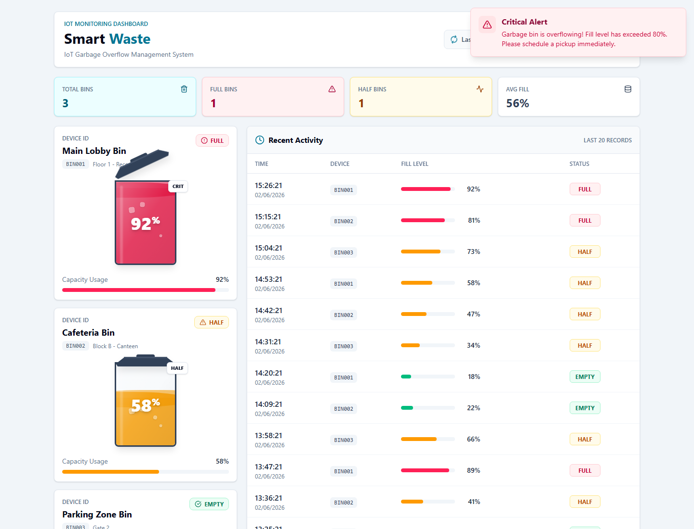
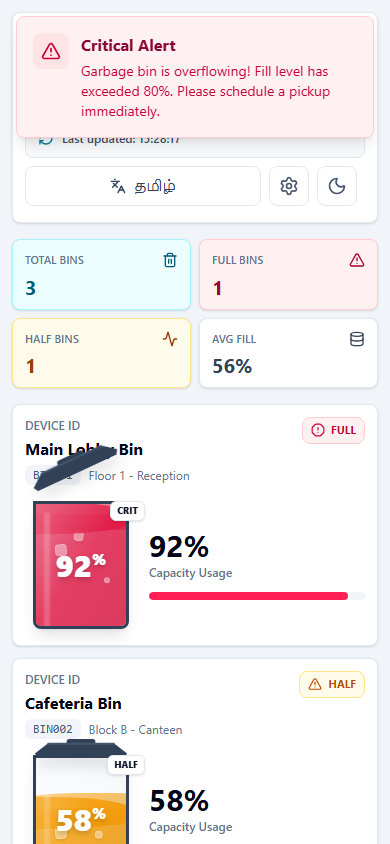

# Smart Waste Management System

A full-stack IoT dashboard for monitoring garbage-bin fill levels, managing registered dustbins, and reviewing recent status history. The system is designed for an ESP32 or any HTTP client to send fill-level readings to a backend API, store them in Supabase, and display live operational status in a responsive React dashboard.

## Live Deployment

Live URL: [https://invoice-generatorsystem.netlify.app/](https://invoice-generatorsystem.netlify.app/)

## Screenshots

Screenshots below use sample local API data so every dashboard state is visible.





## Features

- Real-time dashboard polling for dustbin status updates.
- Fill-level metrics for total bins, full bins, half-full bins, and average fill.
- Automatic status classification: `EMPTY`, `HALF`, and `FULL`.
- Critical overflow alert when a bin exceeds the full threshold.
- Animated dustbin cards with capacity bars and device details.
- Recent activity table showing the latest fill-level records.
- Dustbin registry management for adding, editing, unregistering, and deleting discovered bins.
- Responsive desktop and mobile layouts.
- Light/dark theme toggle.
- Language toggle for English/Tamil dashboard labels.
- Supabase PostgreSQL persistence for readings and registered dustbins.

## Tech Stack

| Layer | Technology |
| --- | --- |
| Frontend | React 19, Vite 7, Tailwind CSS 4 |
| UI/UX | Framer Motion, Lucide React |
| API client | Axios |
| Backend | Node.js, Express local dev server, Vercel-style API route handlers |
| Database | Supabase PostgreSQL |
| Deployment support | Vite build output, `vercel.json`, same-origin `/api` routes |
| IoT integration | ESP32 or any device that can send HTTP POST requests |

## Architecture Overview

```text
[ESP32 / Sensor Client]
        |
        | POST /api/bin/update
        v
[API Route Handlers]
        |
        | Supabase client
        v
[Supabase PostgreSQL]
        ^
        | GET /api/bin/status
        | GET /api/bin/history
        | GET /api/registry/list
        |
[React Dashboard]
```

### Data Flow

1. A sensor client calculates a bin fill percentage.
2. The client sends `{ "deviceId": "BIN001", "fillPercentage": 75 }` to `/api/bin/update`.
3. The backend classifies the reading:
   - `0-30`: `EMPTY`
   - `31-80`: `HALF`
   - `81-100`: `FULL`
4. The reading is stored in the `bins` table in Supabase.
5. The dashboard polls the registry, latest bin status, and history endpoints.
6. Users manage friendly bin names and locations through the registry modal.

## Project Structure

```text
.
|-- api/
|   |-- bin/
|   |   |-- update.js
|   |   |-- status.js
|   |   `-- history.js
|   `-- registry/
|       |-- add.js
|       |-- list.js
|       |-- update.js
|       `-- delete.js
|-- lib/
|   `-- supabaseClient.js
|-- public/
|   `-- screenshots/
|-- scripts/
|   `-- verify_backend.js
|-- src/
|   |-- components/
|   |-- context/
|   |-- services/
|   |-- App.jsx
|   `-- main.jsx
|-- supabase_schema.sql
|-- api-server.js
|-- package.json
|-- vite.config.js
`-- vercel.json
```

## Setup Instructions

### Prerequisites

- Node.js `20.19+` or `22.12+`
- npm
- Supabase project
- Optional: ESP32 hardware or another HTTP client for sending readings

### 1. Clone and Install

```bash
git clone <your-repository-url>
cd smart-waste-management-system
npm install
```

### 2. Create the Supabase Database

1. Create or open a Supabase project.
2. Go to the Supabase SQL Editor.
3. Run the full contents of `supabase_schema.sql`.

This creates:

- `bins`: stores sensor readings, status, and timestamps.
- `dustbin_registry`: stores registered device IDs, display names, and details.

### 3. Configure Environment Variables

Create a local `.env` file from the example:

```powershell
Copy-Item .env.example .env
```

Fill in your Supabase values:

```env
VITE_SUPABASE_URL=your_supabase_url
VITE_SUPABASE_ANON_KEY=your_supabase_anon_key
SUPABASE_URL=your_supabase_url
SUPABASE_ANON_KEY=your_supabase_anon_key
```

Do not expose a Supabase `service_role` key in the frontend.

### 4. Run Locally

Start the frontend and local API server together:

```bash
npm run dev
```

Default local URLs:

- Frontend: `http://localhost:5173`
- Local API server: `http://localhost:3000`

You can also run each side separately:

```bash
npm run dev:frontend
npm run dev:backend
```

For a Vercel-like local environment:

```bash
npm run dev:full
```

### 5. Verify the Backend

After the backend is running:

```bash
npm run verify:backend -- http://localhost:3000
```

For a deployed backend:

```bash
npm run verify:backend -- https://your-domain.example
```

## API Reference

### Submit Bin Reading

```http
POST /api/bin/update
Content-Type: application/json
```

```json
{
  "deviceId": "BIN001",
  "fillPercentage": 85
}
```

### Get Latest Status

```http
GET /api/bin/status?deviceId=BIN001
```

### Get Recent History

```http
GET /api/bin/history
GET /api/bin/history?deviceId=BIN001
```

### Manage Dustbin Registry

```http
GET    /api/registry/list
POST   /api/registry/add
PUT    /api/registry/update
DELETE /api/registry/delete?id=<registry-id>
```

Example registry payload:

```json
{
  "deviceId": "BIN001",
  "name": "Main Lobby Bin",
  "details": "Floor 1"
}
```

## ESP32 Request Example

Use your deployed API URL as the hardware server URL:

```cpp
const char* serverUrl = "https://your-domain.example/api/bin/update";
```

Payload expected by the backend:

```json
{
  "deviceId": "BIN001",
  "fillPercentage": 75
}
```

## Build and Deployment

Run checks before deploying:

```bash
npm run lint
npm run build
```

The frontend build output is generated in `dist/`.

For a static frontend deployment, use:

- Build command: `npm run build`
- Publish directory: `dist`

Important: this app uses same-origin `/api` routes. A deployment must also provide the backend API routes or proxy `/api/*` to a deployed backend. This repository includes `vercel.json` and Vercel-style route handlers under `api/`.

To deploy with the included Vercel workflow:

```bash
npm run deploy
```

Set these environment variables in the deployment platform:

```env
SUPABASE_URL=your_supabase_url
SUPABASE_ANON_KEY=your_supabase_anon_key
VITE_SUPABASE_URL=your_supabase_url
VITE_SUPABASE_ANON_KEY=your_supabase_anon_key
```

